# Using Interpretable Models To Analyze Speed Dating Factors
## ORIE 4741 Final Report

Jack Beautz and Caleb Berman

--------
## The Problem

They say “First Impressions are Everything.” This is especially true today where people increasingly match with potential dating partners based on limited information obtained quickly via dating apps. Prior to the abundance of apps like Tinder and Hinge, one very popular method for meeting potential partners physically was via speed dating events where each permutation of the dating pool (in this case only Male and Female pairings) interact for a set short amount of time before making a decision to agree to further meetings. We were interested in what variables most influence the decisions made in these dating formats and how accurately we could predict a given person to be given the chance at further dates.

## The Dataset

All data is derived from multiple rounds of a speed dating event proctored by Columbia Professors Ray Fisman and Sheena Iyengar. The data from each permutation of partners was collected via a survey after a 4-minute speed date detailing in which participants were asked to rate their partner on 1-10 scales on Attractiveness, Sincerity, Intelligence, Fun, Ambition, and Shared Interests. Other lifestyle and background information for each participant was derived from a questionnaire at the onset of the experiment.

Each participant of the speed dating study was given a unique iid key. The rows of the dataset contain every possible pairing between two people: an individual’s iid with their partner’s key, pid. While the number of rows in this data set is relatively small, the data is very feature rich.

There are two binary features that could be considered to be the target of our analysis, dec_o and match, which indicate the decision to match or not by the partner and whether or not both people decided to match in the pairing respectively. We opted to predicted dec_o for two reasons. Firstly, we hypothesized that predicting a match would be more difficult since it relies on the personal preferences of both partners in the matching and secondly, our dataset was already on the smaller side (< 10,000 rows) and using match  as a target would half our usable data as we would have to remove the double counted permutations.

In total there are 195 columns and 8378 rows to this dataset.

### Data Cleaning and Feature Engineering

The data had missing values for both the target as well as some of the features. We found that while some features had relatively small frequencies of being missing (attraction, age, etc), other features were missing greater than 10% of the time (median SAT score). Overwhelmingly we found that the features with high frequency of missing values were heavily derived by the researcher’s of the study. For example income wasn’t the persons listed income but was in fact the median income of the zipcode they grew up in. Due to the smaller nature of our dataset and the fact that in most cases if one feature was missing values the related features would be too (in most cases if someone wasn’t rated on attractiveness they weren’t rated on sincerity either for example), we didn’t have confidence in the accuracy of imputation methods and decided to drop features that were missing greater than 10% of the time and drop the remaining rows that were either missing features or the target. This reduced our dataset to 6838 or in other terms 81.6% of the original data was used. Among this remaining data we found that 2952 rows constituted data were a positive decision had been made or around 43% of the time a person decided to match. We concluded this meant our dataset was fairly balanced in its outcome and wouldn’t overfit to one specific class.

For our analysis we engineered 5 features. First we created a field that was the average attractiveness rating of each unique person made by all other people that they had dates with. Next we created a field that was the average attractiveness ranking of others made by the unique person for all dates. This way we could have a sense for how average attractiveness and willingness to rate other individuals as more attractive play out in our model. There were two other fields within the data, date and go_out. These represented ordinal values for the frequency each person went on dates and went out in general. In the original data, these were encoded such that a value of 1 represented those who went out the most, and 7 the least. Rather than employ methods such as many-hot encoding for this ordinal variable and lose interpretability of our features, we treated it as a continuous variable and reversed the direction of the original encoding making it so that a values of 7 represented the value of those who went out the most and 1 the value of those who went out the least. Lastly we calculated the age difference between the two partners on the date as we thought that was more informative than just the age of each partner alone.

An overview of each feature used and it’s description can be found in a schema in the appendix.

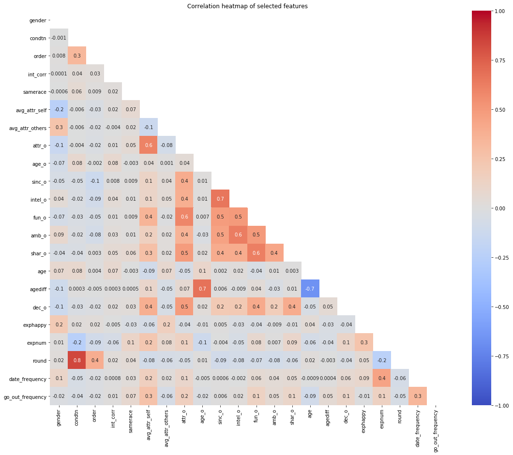

## Approach

To approach this problem we attempted to utilize three different models in increasing complexity. A logistic loss model, a random forest, and lastly an Explainable Boosting Machine. We chose the logistic loss and the Explainable Boosting Machine due to their high interpretability. The random forest was initially chosen to compare our more interpretable models to a more predictive baseline, however some methods were found to probe the importance of each feature within the random forest. In order to fit these models we utilized SciKit-Learn's implementations of Logistic regression and random forrest classifier, and the InterpretML package to fit the explainable boosting machine.

Given that our data was quite small there was concern that calculating accuracy utilizing a 80 - 20 test train split wouldn’t leave enough data behind to get accurate statistics on the test set. In order to avoid this fact as well as overfitting, we utilized 5-fold cross validation on each model. We then calculated and reported the mean misclassification rate on the test set as well as the mean misclassification rate on the training set.

| 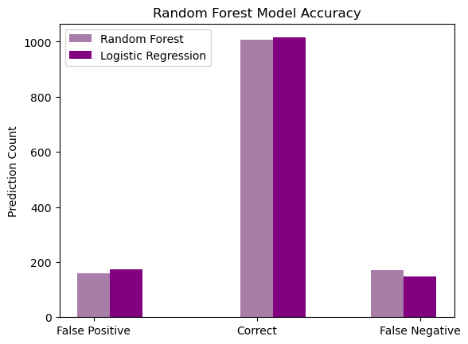 |
|:--:|
| **Figure 2**  Model Accuracy |

| 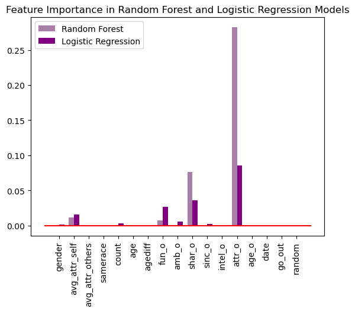 |
|:--:|
| **Figure 3** Feature Importance |

### Feature Importance

SciKit-Learn’s Permutation Feature Importance method scores the importance of features in a model’s predictions. The method defines a baseline score for all features and then permutes columns one at a time. The change in misclassification rate when a feature is randomly permuted is then used to calculate this features impact on the overall model’s accuracy. This method was used in the Logistic and Random Forest models below to improve interpretability. A random feature was fed into the models to serve as an additional baseline. In all graphs created with Permutation Feature Importance (Figure 3) a red line is drawn at the level of the measured importance of the random feature. We define important features as those with measured importance greater than the random feature.

### Logistic Loss with L2 Regularization

Mean Training Set Misclassification Rate: 0.248
Mean Test Set Misclassification Rate: 0.2668

Logistic Models are used to predict a binary classifier using a numeric dataset. The resulting model is produced by minimizing the following objective:

$$\Sigma l_{logistic} + \lambda *\Sigma w^2$$

Subject to loss:
$$\mathcal{l}_{logistic}(x,y;w) = log(1+e^{-yw^T x})$$

We fit a logistic model to our data to have a probabilistic interpretation of predictions. We used L2 regularization with $\lambda$ equal to 1 as that performed better compared to l1 regularization and changing $\lambda$ slightly only had negligible effects on the model. The model was fit on all features listed above but, after applying an L2 regularizer, all but four coefficients were pushed towards zero. As a result we identified fun_o, shar_o, avg_attr_self and attr_o as the features which had the most impact on the model’s predictions for a partner’s interest. In Figure 3 observe that SciKit-Learn’s permutation feature importance attribute identified these four features as well. These results suggest that partners’ are most likely to want to match with people who they perceive as fun, having shared interests/hobbies, and physically attractive.

### Random Forest Model

Mean Training Misclassification Rate: 0.250
Mean Test Set Misclassification Rate: 0.266

Random Forest Regression models are built by averaging the results of multiple decision tree regressors’ fit on sub-samples of the data. The resulting model is generally more accurate and robust than a given decision tree. Individual decision trees are built using dataset features as nodes where predictions are made on each node using a regression or classification model to direct the next node which should make a decision on the next feature in the dataset.

A Random Forest Model was fit to the same feature set using a maximum node depth of three to ensure no overfitting. The model performed equally well on the train and test datasets suggesting that overfitting was avoided. The type I and type II error rates were balanced suggesting misclassifications are equally likely for negative and positive predictions. The permutation feature importance method results depicted in Figure 3 identified avg_attr_self, fun_o, shar_o and attr_o as important features in the model. These results agree with those of the logistic regression and the feature importance measurements produced by the model.

### Explainable Boosting Machine

Mean Training Misclassification Rate: 0.2254
Mean Test Set Misclassification Rate: 0.2403

The last model we fit on our dataset was an Explainable Boosting Machine (EBM), a technique recently developed by Microsoft Research. EBMs are a form of generalized additive model (GAM). GAMs are a generalization of linear models in which the target can depend on the sum of any arbitrary function applied to each feature. This is represented by the following equation:

$$g(E[y]) = \beta_o + \Sigma{f_j(x_j)}$$

EBMs are trained by generating small classification trees that only utilize one feature each. It then utilizes boosting where trees with greater error are weighted higher in their model output importance. The EBM then repeats this process through each of the features 5000 times so that it can then summarize the net results for each feature in the form of a function. We hoped that the nonlinearities in these functions would provide insight into the importance of the features in more nuanced ways than the earlier logistic regression and random forest.

Graphs for the models dependence on each feature are shown below.

| 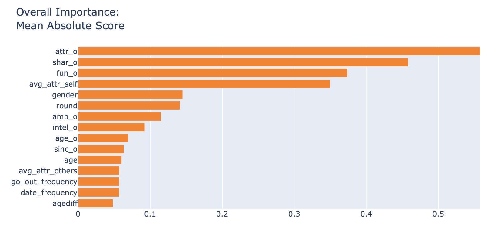 |
|:--:|
| *Figure 4*  Mean feature importance on EBM |

This implied a similar overwhelming importance on attractiveness, shared interests, and fun that the logistic regression showed.

| | | |
| --------- | -------- | -------- |
| 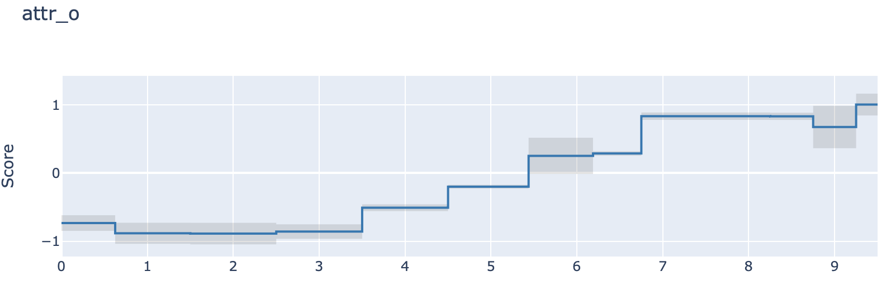 | 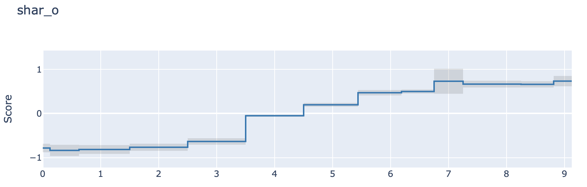| 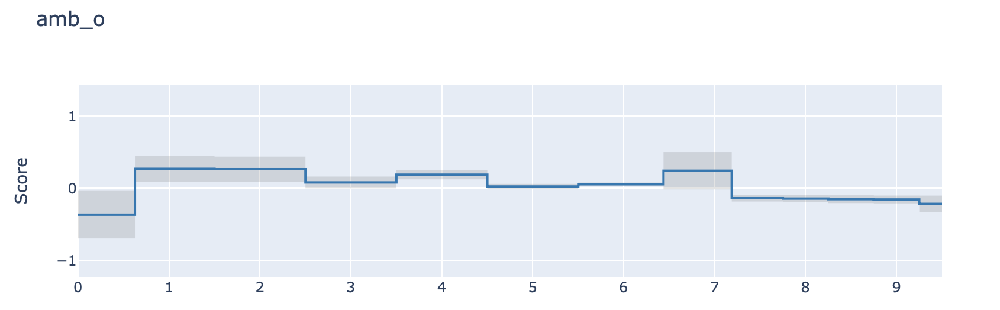|
| Physical Attractiveness | Shared Interests | Ambition |
| 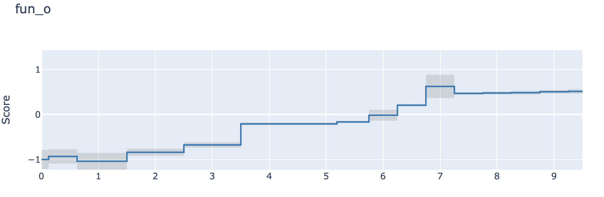 | 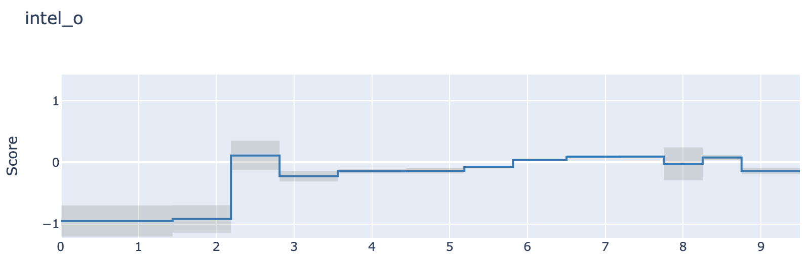| 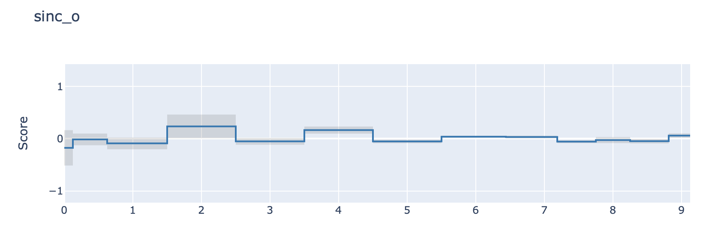|
| Fun | Intelligence | Sincerity |
| 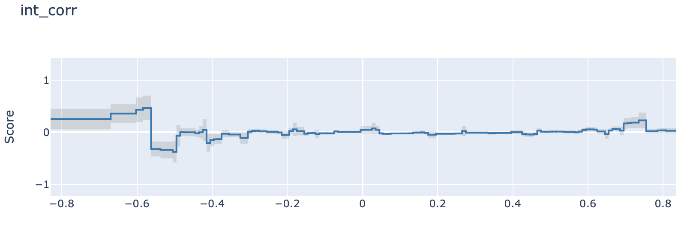 | 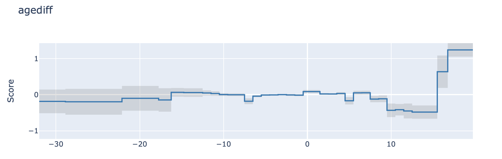| 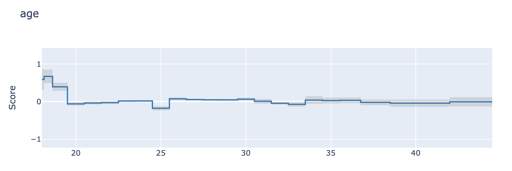 |
| Correlation of Interests | Age Difference | Partner Age |
| 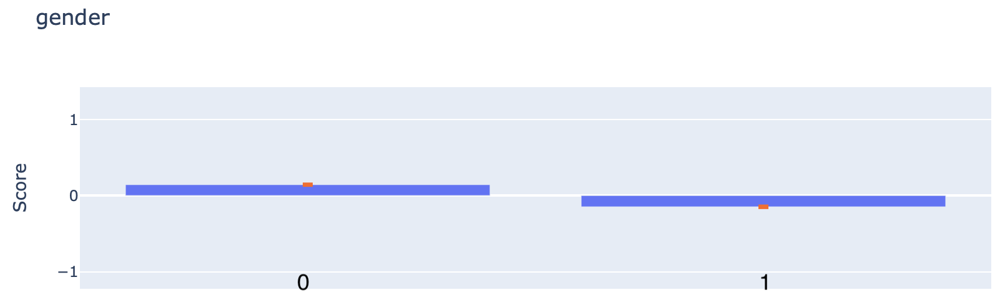 | 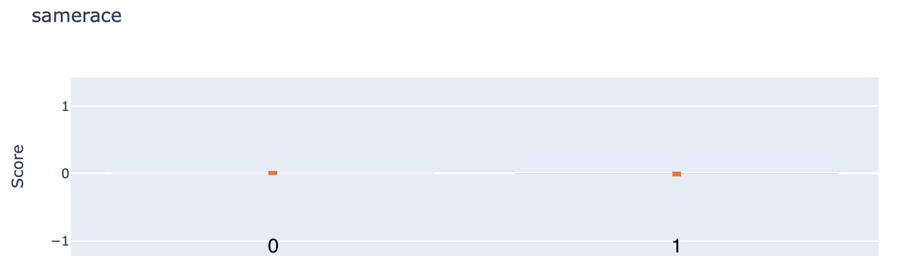| 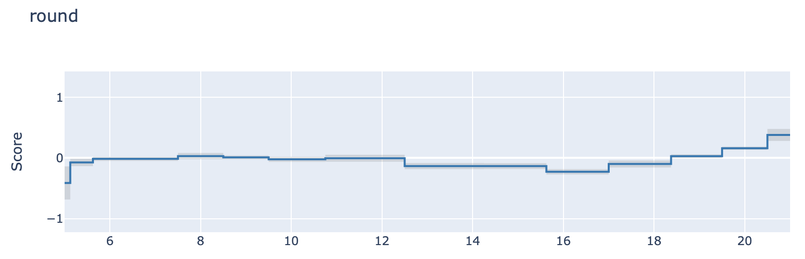|
| Gender | Same Race | Round |

Some interesting inferences can be made from these graphs. For starters, we observed that many of the most important features behaved linearly in the EBM. This would explain why the EBM and Logistic Regression have similar performance on the dataset. We noted that a person’s intelligence did not affect their prediction of being matched significantly until it fell below roughly 2.2. This seems to suggest that as long as you are above some baseline intelligence, how smart you are doesn’t matter for these short-duration dates.

## Fairness and Weapons of Math Destruction

While our model does take race into account, it only assesses on whether the individual and partner are the same race. Since the model wasn’t trained on any racial or socioeconomic factors that could be correlated with race we believe that it is an unbiased model. In our opinion, having the same race feature did not constitute bias for two overall reasons. Firstly the context of dating is one rare instance in which people are legally allowed to be discriminatory if they have a racial preference in their partner. Secondly, and more importantly, most of our models found the same race feature to be negligible.

For the same reasons above we believe that if this model were put into production it would not constitute a “Weapon of Math Destruction” as outlined in Cathy O’Neil’s book of the same name. O’Neil qualifies a “WMD” as a model whose outcome is not easily measurable, whose predictions can have negative consequences, and lastly whose decisions reinforce discrimination. We believe our model to not fit any of these three criteria as it has a clear measurable outcome and each event in the pairings is independent of the other predictions.

## Conclusions

All three of the models we developed arrived at approximately the same misclassification rate and produced roughly the same mean misclassification rates on the testing and training datasets. Given that we were trying to predict something as complex as human behavior based on a few features, we thought that correctly classifying a positive decision roughly 75% of the time was quite good. We are confident in the results of the models and believe that they arrived at a reliable response to this report’s initial question. The models identified physical attractiveness, shared interests, and fun as having the most impact on an individual’s romantic interest in another person. Physical attractiveness was found to be by far the most important of these attributes, with shared interests being about half as important.

## Works Cited

InterpretML: A Unified Framework for Machine Learning Interpretability" (H. Nori, S. Jenkins, P. Koch, and R. Caruana 2019)

Fisman, Raymond, et al. “Gender Differences in Mate Selection: Evidence from a Speed Dating Experiment.” The Quarterly Journal of Economics, vol. 121, no. 2, 2006, pp. 673–697. JSTOR, www.jstor.org/stable/25098803. Accessed 13 Dec. 2020.

L. Breiman, “Random Forests”, Machine Learning, 45(1), 5-32, 2001. https://doi.org/10.1023/A:1010933404324

## Appendix

| Feature Name     | Description |
| ----------- | ----------- |
| dec_o | Decision to match by parter (0 if no and 1 if yes)      |
| gender  | Gender of partner (1 if male and 0 if female)      |
| attr_o        | Physical attractiveness rating of individual by given partner (1-10)    |
| avg_attr_self | Average physical attractive rating of individual given by all partners (1-10)       |
| avg_attr_others | Average physical attractive rating of partners given by individual (1-10)       |
| samerace | (0 if individual and partner of different races and 1 if same race)      |
| count | Total number of partners an individual had over entire study     |
| round | Total number of partners an individual had in given round of study    |
| age | Age of partner |
| age_o | Age of individual |
| agediff | Age of partner minus Age of individual |
| fun_o | Rating by given partner of how fun individual is (1-10)    |
| amb_o  | Rating by given partner of how ambitious individual is (1-10)    |
| shar_o | Rating by given partner of shared interests of hobbies with individual (1-10)    |
| sinc_o | Rating by given partner of how sincere individual is (1-10)        |
| intel_o | Rating by given partner of how intelligent individual is (1-10)    |
| int_corr | correlation between individual's and partner’s ratings of interests |
| date | How often partner goes on dates (1- 10)    |
| go_out | How often partner goes out (not necessarily on dates) (1-10) |
| random | Random boolean value |

**“_o” suffix denotes the feature describes the individual. No suffix features describe the partner deciding on the individual.**
